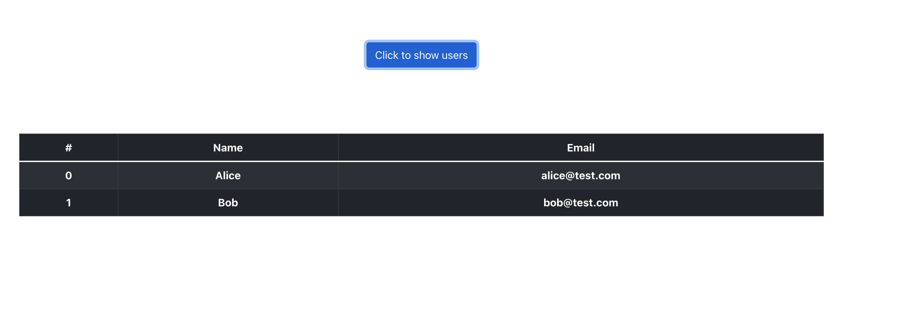

# go-server
simple http server

# features
- [x] use `ServeMux` for routing
- [x] include testing cases examples
- [x] set up in-memory database to demonstrate database access
- [x] use [create-react-app](https://create-react-app.dev/) template to add an simple UI demonstrating data fetch

# clean, test, build and serve
```
make all
```

# run unit test cases
```
make test

go test ./... -test.v
?       go-server       [no test files]
=== RUN   Test_List
--- PASS: Test_List (0.00s)
=== RUN   Test_Users
--- PASS: Test_Users (0.00s)
PASS
ok      github.com/uitachi123/simple-go-server/pkg/api       (cached)
=== RUN   Test_Init
--- PASS: Test_Init (0.00s)
PASS
ok      github.com/uitachi123/simple-go-server/pkg/db        (cached)
=== RUN   Test_Echo
--- PASS: Test_Echo (0.00s)
PASS
ok      github.com/uitachi123/simple-go-server/pkg/echo      (cached)
```

# server options
```
Usage of ./go-server:
  -logging string
        logging level (default "INFO")
  -port string
        listening port (default "8080")
```

# server APIs
testing:
```
localhost:8080/echo/testdata
```
response:
```
testdata!
```
<br/><br/>
health check:
```
localhost:8080/healthz
```
response:
```
OK
```
<br/><br/>
API:
```
localhost:8080/users
```
response:
```
[
      {
            email: "alice@test.com",
            name: "Alice",
      },
      {
            email: "bob@test.com",
            name: "Bob",
      },
]
```

# UI
it can fetch data from API via path `localhost:8080/users`
